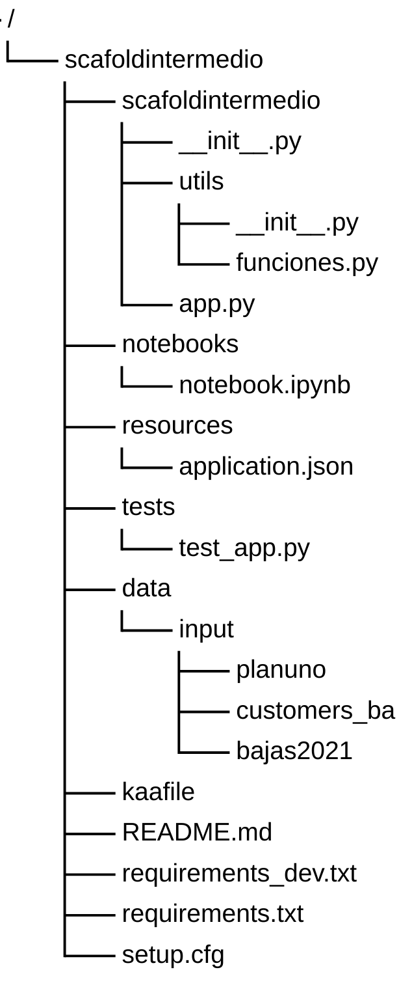

# Ejercicio básico para aprender a usar Git

Engine del caso de uso básico, adaptado a Python y pandas para su ejecución en local.

### Estructura básica del repositorio

- **Carpeta scafoldintermedio**: contiene los archivos principales del engine y define el paquete Python del proyecto.
    - **app.py**: punto de entrada del programa. Lee la configuración e inicia la ejecución del engine.
    - **Carpeta utils**: contiene los módulos con las transformaciones del proceso.
        - **funciones.py**: define `ClaseEngine`, con la lectura de datos, las transformaciones y la escritura del resultado.
        - **\_\_init\_\_.py**: identifica la carpeta como un paquete Python.
- **Carpeta notebooks**: contiene cuadernos interactivos para escribir código, explorar los datos y anotar observaciones. `notebook.ipynb` es un cuaderno de trabajo inicial para el alumno.
- **Carpeta resources**: contiene la configuración del proyecto. En esta adaptación, **application.json** cumple la función de configuración que tiene `application.conf` en el engine original. El punto de entrada lee este archivo directamente.
- **Carpeta tests**: contiene los tests unitarios del engine. Los archivos de pruebas utilizan el prefijo `test_`.
    - **test_app.py**: comprueba las transformaciones de `ClaseEngine` con datos de prueba en memoria.
- **Carpeta data/input**: contiene los datos de entrada del Caso de Uso 3. Los archivos Parquet deben copiarse en **planuno**, **customers_ba** y **bajas2021**, respectivamente. Los datos no se incluyen en el repositorio.
- **Carpeta docs**: contiene la guía de preparación del entorno y el enunciado del laboratorio.
- **kaafile y setup.cfg**: archivos reservados para la configuración del proyecto, conservados de la estructura original. En esta versión están vacíos y no intervienen en la ejecución local.
- **requirements.txt y requirements_dev.txt**: contienen las dependencias del proyecto. El primero incluye las librerías del engine y el segundo añade las necesarias para ejecutar los tests.
- **README.md**: describe el proyecto y la función de sus archivos y carpetas.

### Estado de la práctica

Validación pendiente en la rama principal.